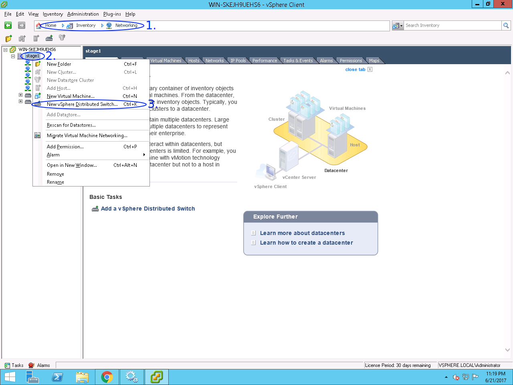
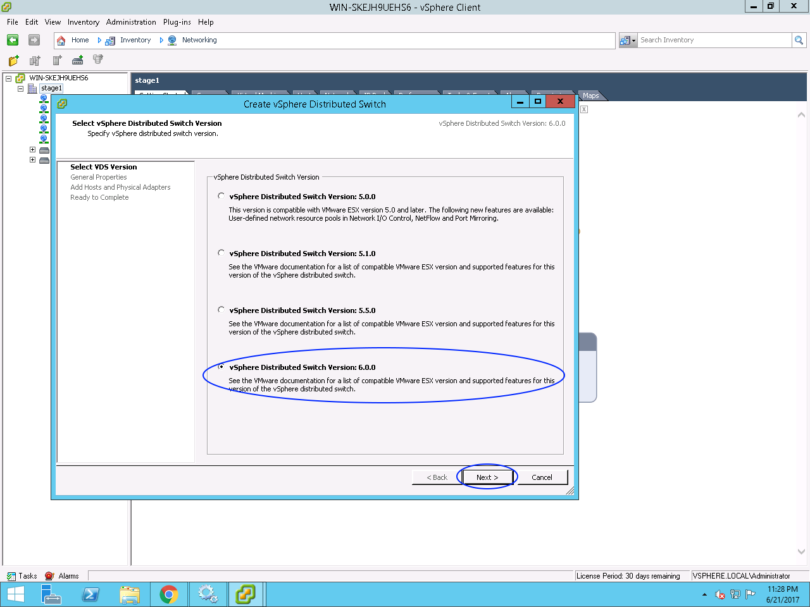
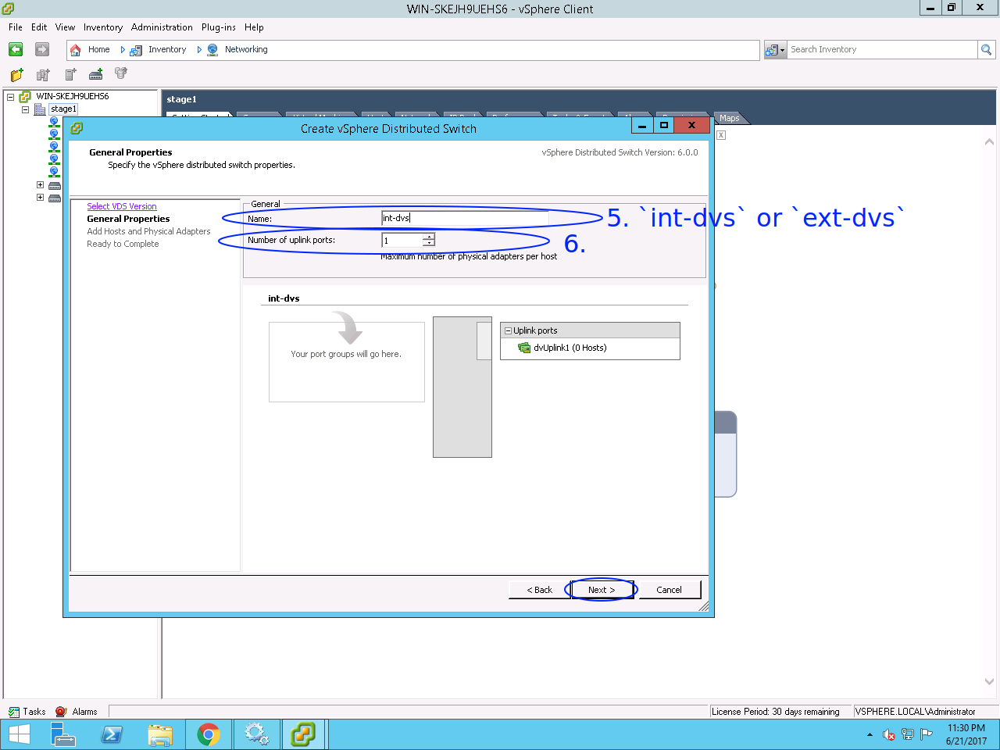
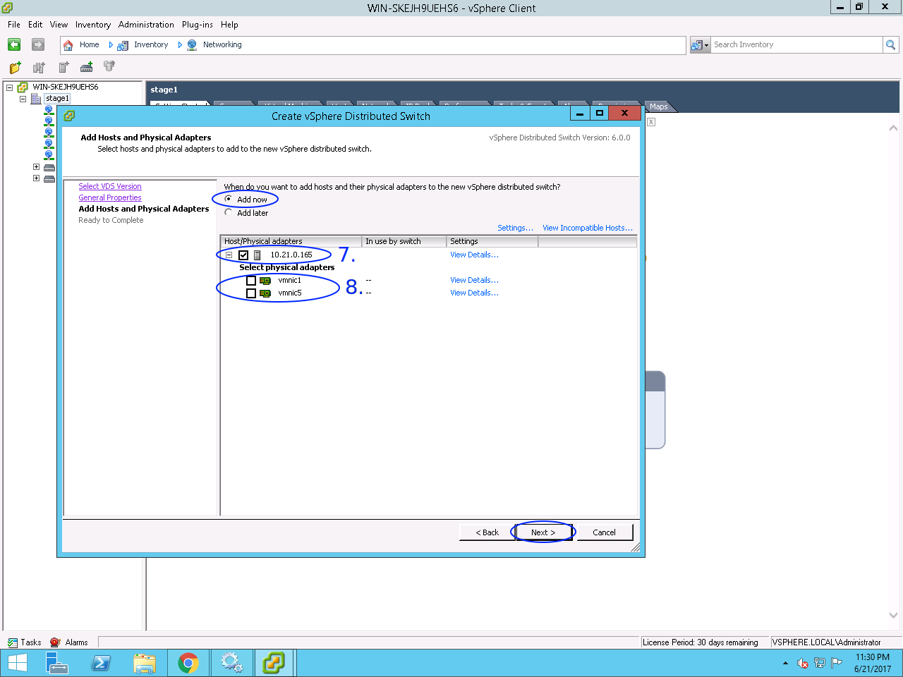
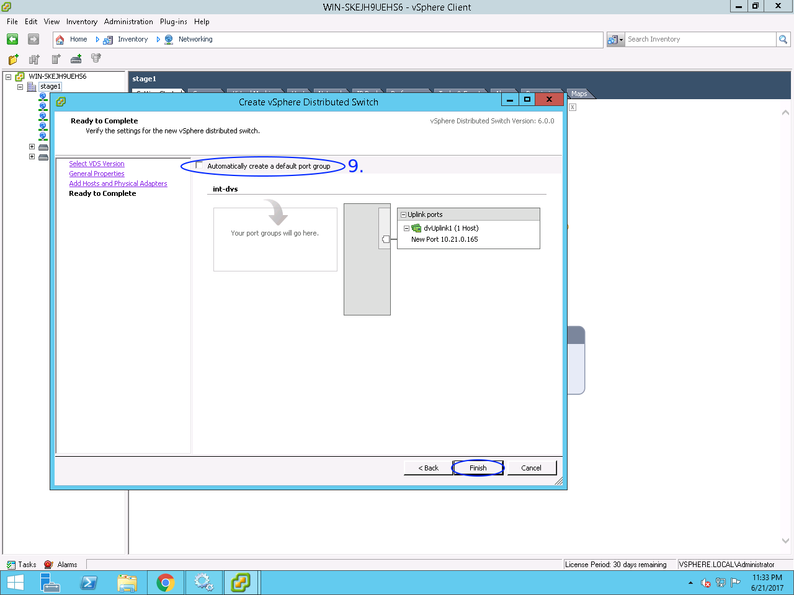
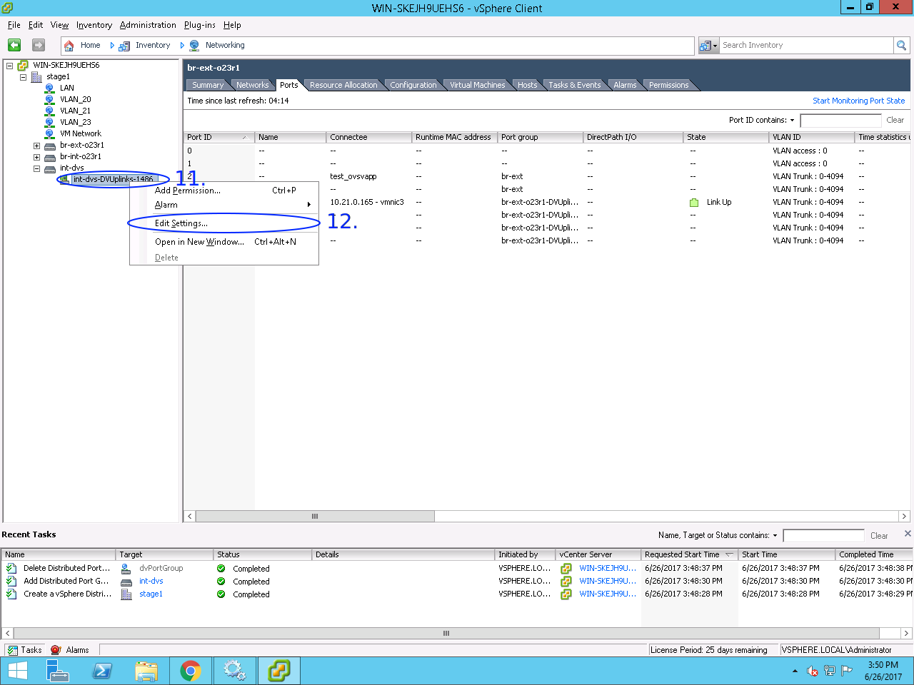
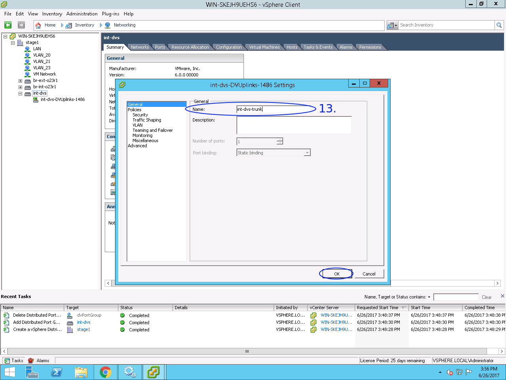
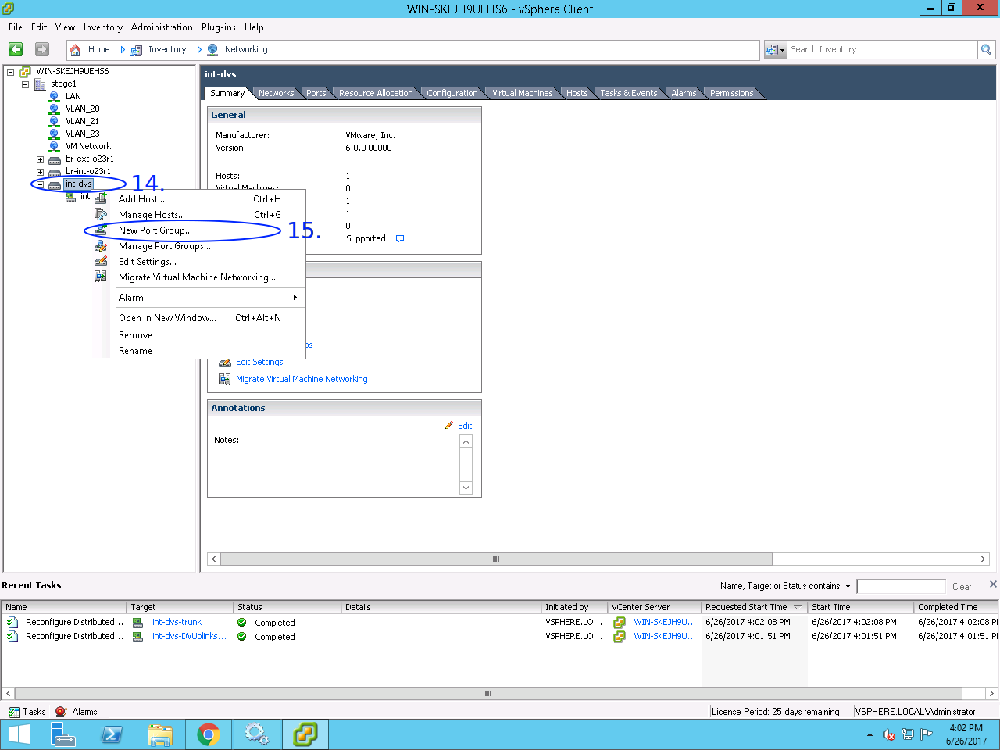
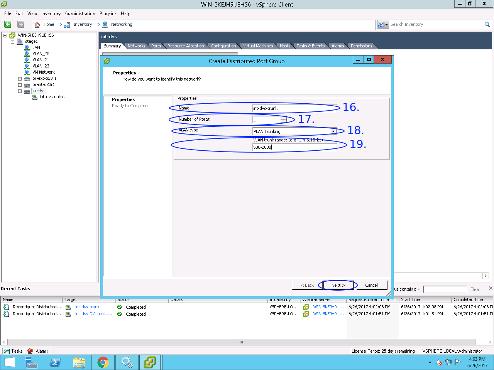
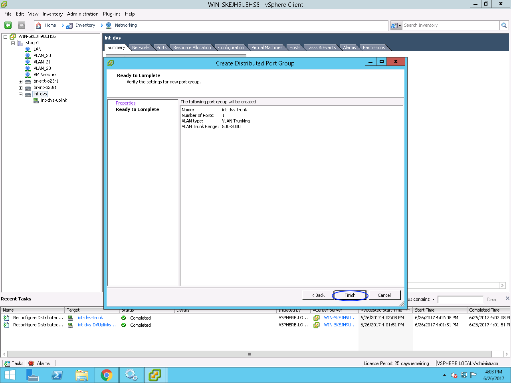

### vCenter Distributed Virtual Switch allocation howto

1. Browse vCenter location: *Home / Inventory / Networking*

2. Right-click on datacenter item in sidebar tree (*stage1*)

3. Click on *New vSphere Distributed Switch...* menu item

4. In appeared dialogue choose *vSphere Distributed Switch Version: 6.0.0*

5. Set DVS *Name* field (`int-dvs` for internal DVS, `ext-dvs` for external DVS)

6. Set *Number of uplink ports* (`1`)

7. Check the ESXi host which this DVS is created for

8. Do **not** select any physical adapters if you are configuring *internal*
   DVS, and select at least one physical adapter, that is connected to phisical
   network, if you are configuring *external* DVS

   *NOTE:* Ignore warning about physical adapters absense in case if you are
   configuring *internal* DVS (click *Yes*)

9. In appeared window uncheck *Automatically create a default port group*;
   click *Finish*

10. At this point, you should see configured DVS in sidebar tree

11. Right-click the DVS's uplink port group

12. Click on *Edit settings...* menu item

13. On *General* page adjust uplonk port group *Name* (`int-dvs-uplink` for
    *internal* DVS, `ext-dvs-uplink` for *external DVS)

14. Right-click on recently created DVS

15. Click on *New Port Group...* menu item

16. In appeared window, set *Name* of port group (`int-dvs-trunk` for *internal*
    DVS, `ext-dvs-trunk` for *external* DVS)

17. Set *Number of Ports* (`1`)

18. Set *VLAN type* as `VLAN Trunking`

19. Set *VLAN trunk range* to the tenants VLAN rabge (`500-2000`)

20. Check out port group configuration and finish its creation

At this point you should have configured vCenter Distributed Switch(es).
The main difference between *internal* and *external* DVSes (except their names
and port group identifiers) is that *external* DVS **has** a physical adapter(s)
in its uplink port group, and *internal* DVS is **not**.
