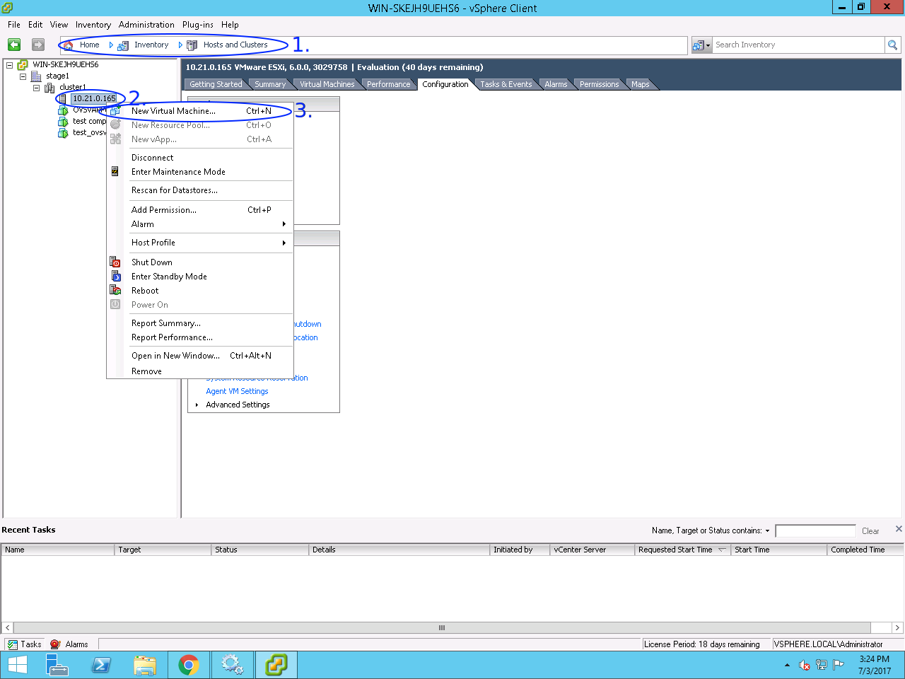
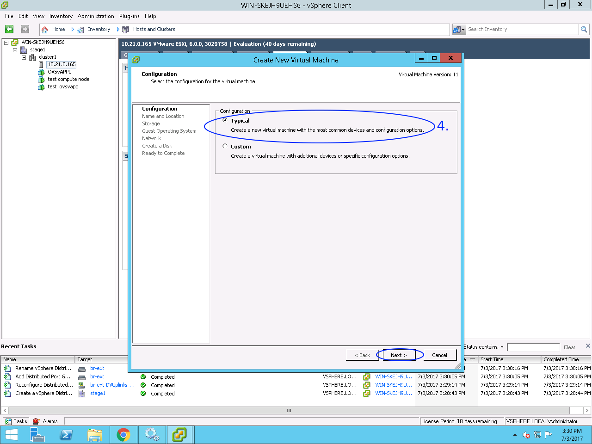
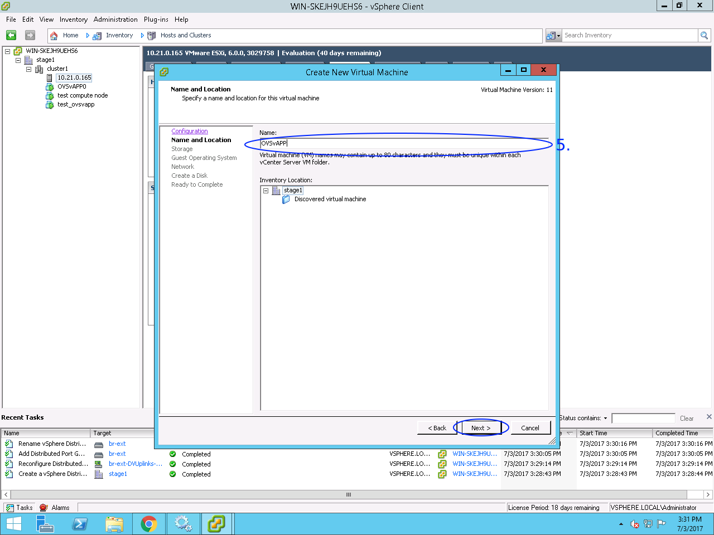
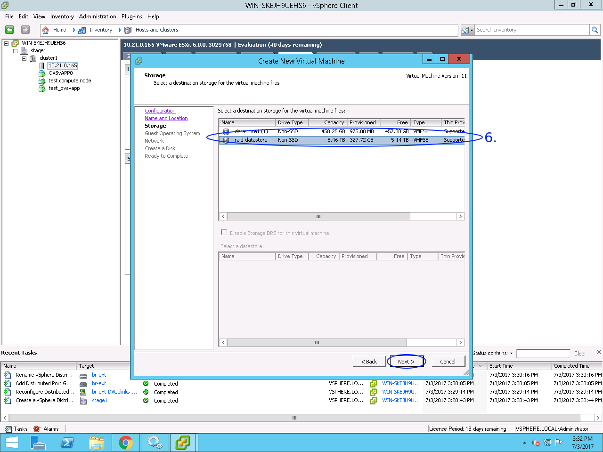
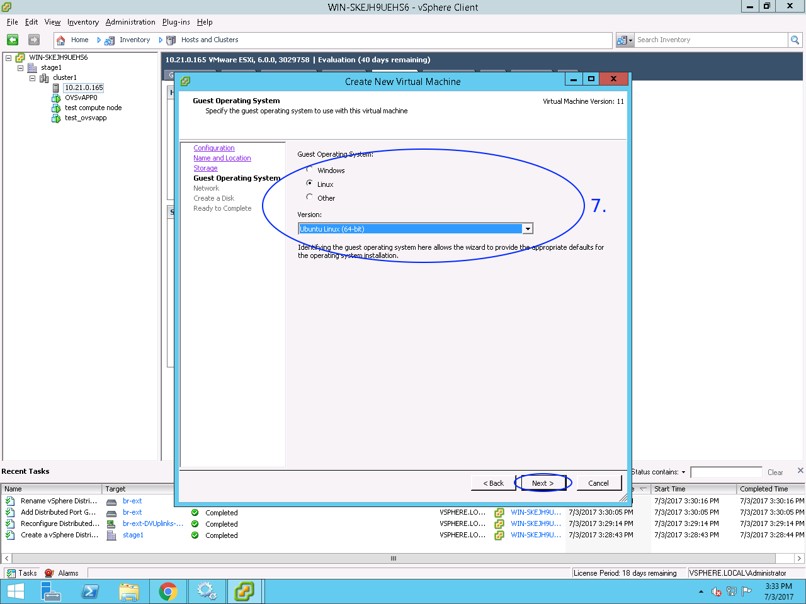
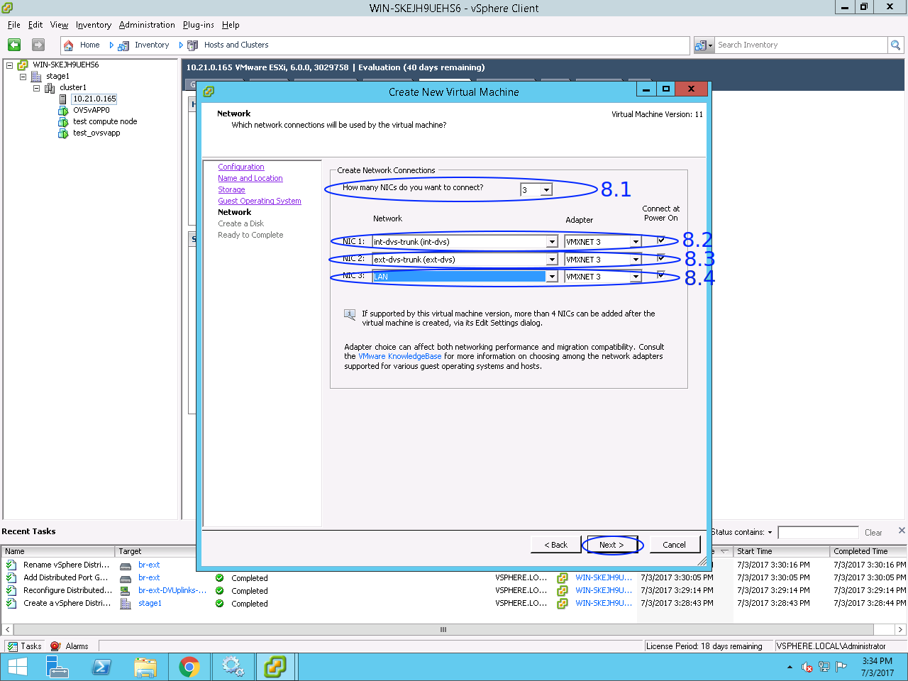
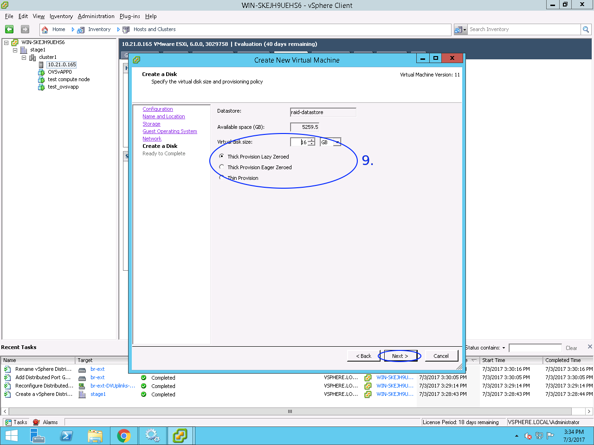
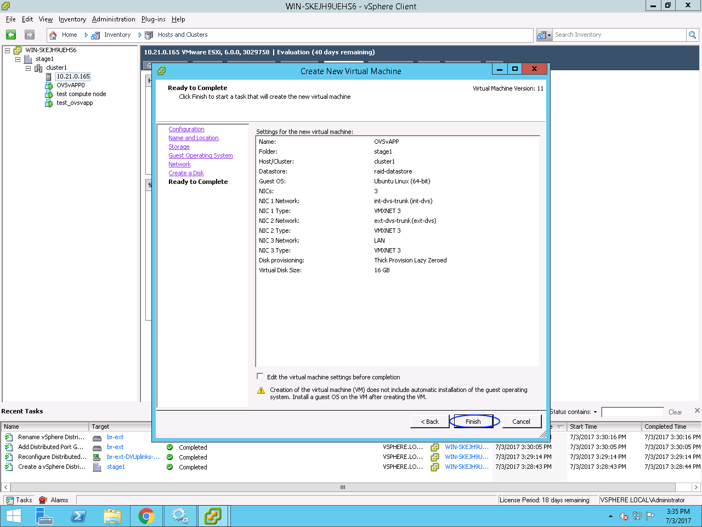

### vCenter OVSvAPP VM allocation howto

1. Browse vCenter location: *Home / Inventory / Hosts and Clusters*

2. Right-click on host item in sidebar tree, on which you want to allocate VM

3. Click on *New Virtual Machine...* menu item

4. In appeared dialogue choose *Typical* VM configuration

5. Set OVSvAPP VM name

6. Choose VM data storage

7. Configure guest operating system

8. Configure VM network:

    8.1. Set 3 NICs

    8.2. Set NIC 1 connected to *trunk port* of *internal DVS*

    8.3. Set NIC 2 connected to *trunk port* of *external DVS*

    8.4. Set NIC 3 connected to *management network*

9. Configure VM disk

10. Finish VM allocation and proceed with OS installation.

